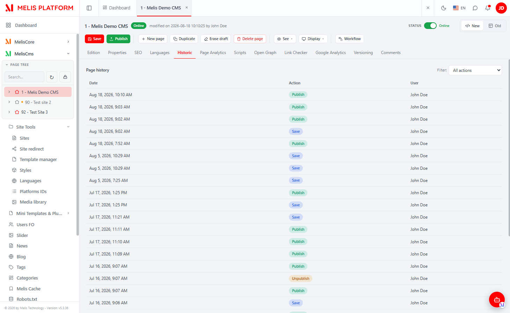
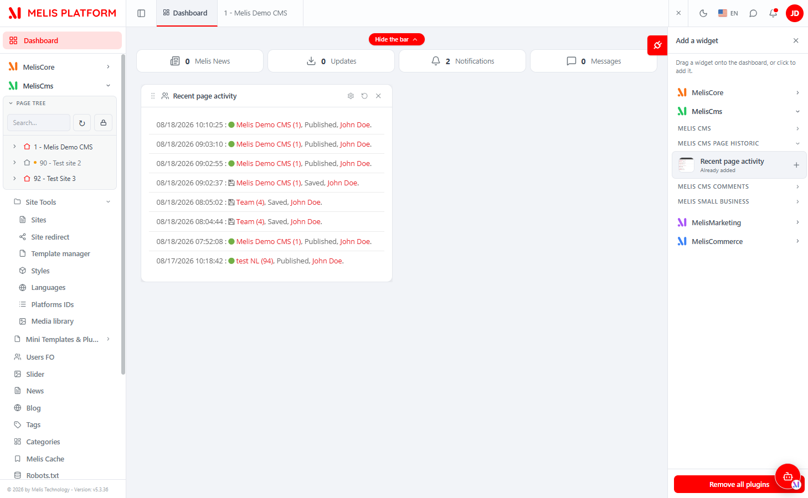

# MelisCmsPageHistoric (React back-office) — Functional & Technical Documentation (for AI)

> **What this is.** MelisCmsPageHistoric is the **audit log for page editing**: it automatically
> records who did what to a page and when (save, publish, unpublish, delete…). This document covers
> it **in the new React back-office** (`/melis-react`). The module is **unusual**: it ships **no
> brick of its own** (no `ui-react/`, no `public/ui-react/brick.manifest.json`). Instead it
> surfaces through two host-owned surfaces:
> 1. a **"Historic" tab** contributed to the React **CMS page editor** — this module ships the
>    **`react-api` endpoint**, the **capability** and the **tab registration**, while the actual
>    **React tab component lives in the melis-core shell** (registered via `window.__melisRegisterPageTab`);
> 2. a **"Recent page activity" dashboard widget** — a **legacy (PHP/phtml) dashboard plugin**
>    rendered inside the React dashboard's widget host (not a React component).
>
> For the underlying data model, the recording listeners and the classic tool, see the
> [legacy doc](./MelisCmsPageHistoric.md); this doc does not repeat them.
>
> **How this document is organised — two clearly separated parts:**
> - **[Part A — Functional Guide](#part-a--functional-guide)** — for everyday users (and the chat
>   assistant) using the React back-office. Plain language.
> - **[Part B — Technical Reference](#part-b--technical-reference)** — for developers and AI building
>   inside the React UI, with code (endpoint, capability, tab/host wiring).
>
> **Audience**: consumed by the **MelisAI** MCP. **Status**: reviewed 2026-08-19.

---

## 0. Where this lives in the React back-office — read this first

- **No standalone tool, no left-menu node.** MelisCmsPageHistoric has **no menu entry** and **no
  brick bundle** of its own. It is a *contribution* module: it plugs a **tab** into a tool owned by
  another module (the CMS page editor) and a **legacy widget** into the dashboard.
- **What THIS module ships (the split — read carefully):**
  - **The API** — `config/react-api.php` declares **`GET /melis/react-api/cms-page/historic`**
    (controller `MelisReactApiPageHistoric`, action `list`), which returns the current page's audit
    rows as JSON. See §B3.
  - **The capability** — `config/react.capabilities.php` declares the **Historic tab** capability
    under the **shared** `meliscms_page` rights node (`tabs[]` merge), key
    **`melispagehistoric_historic`**. See §B4.
  - **The tab button registration** — `config/app.interface.php` (`meliscms_tabs`) registers the tab
    button in the CMS page-editor tab row. See §B5.
  - **The dashboard widget** — a **legacy PHP dashboard plugin**
    (`MelisCmsPageHistoricRecentUserActivityPlugin`) rendering a `.phtml` template. See §B6.
- **What lives in the HOST (melis-core), not here.** The **React tab component** for the Historic
  tab is **registered host-side** via the `window.__melisRegisterPageTab` registry — confirmed by
  the controller docblock: *"le composant React est enregistré côté coquille via le registre
  `__melisRegisterPageTab`."* This module contributes only the data + capability + tab-button
  declaration; the CMS page editor that hosts the tab is **MelisCms**.
- **Activation-gated.** The tab (and the dashboard widget) appear **only if the module is active**;
  the tab **button** additionally requires the capability under `meliscms_page` (without it the
  CMS-page caps whitelist hides the button, even for an admin — see §B4).
- **Coupled host modules.** The CMS **page editor** (which owns the tab row) is **MelisCms**; the
  **dashboard** widget host is **MelisCore**. This module also depends on `melis-engine` /
  `melis-front`.

---
---

# PART A — Functional Guide

## A1. What you can do with MelisCmsPageHistoric in the new back-office

- **See the full history of a page** — every save, publish, unpublish and delete, with **who** did
  it and **when**, from a tab inside the page editor.
- **See recent activity across all pages** — at a glance on the back-office **Dashboard** widget.

There's nothing to configure: once the module is active it logs page actions automatically (the
recording is server-side; see the [legacy doc §B3](./MelisCmsPageHistoric.md)). It is a **read-only
log** — for accountability, not a restore tool.

## A2. Finding it in /melis-react

**The Historic tab (per page).** Left sidebar → **MelisCms** → open a **page** → the **Historic**
tab in the page editor's tab row.


*The React CMS page editor with page "1 - Melis Demo CMS" open and the **Historic** tab active: a
"Page history" table listing the current page's actions with columns **Date**, **Action**
(Publish / Save / Unpublish coloured badges) and **User** (John Doe), plus a **Filter: All actions**
dropdown (top-right) to filter by action type.*

**The dashboard widget.** Left sidebar → **Dashboard** → the **Recent page activity** widget.


*The React back-office Dashboard with the **Recent page activity** widget: one line per recent
action (timestamp, a coloured status dot, the page name + id, the action Published/Saved, and the
user), and — in the "Add a widget" side panel — the widget listed under **MELIS CMS PAGE HISTORIC →
Recent page activity** (marked "Already added").*

## A3. Key words explained

- **Historic** — the per-page audit trail (the tab): each row is one recorded action on the page.
- **Action** — the kind of event recorded: **Publish**, **Unpublish**, **Save**, **Delete** (shown
  as coloured badges/dots).
- **Recent page activity** — the dashboard widget showing recent actions **across all pages/users**.
- **Filter (All actions)** — the Historic tab's dropdown to show only one action type.

> For the domain glossary, the data model and how actions are recorded, see the
> [legacy doc](./MelisCmsPageHistoric.md).

## A4. The Historic tab (per page)

Open any page in the editor and switch to **Historic**. It shows a **read-only table** of **this
page's** actions, newest first: **Date**, **Action** and **User**. Use the **Filter (All actions)**
dropdown to narrow to a single action type (Publish, Save, Unpublish, …). The list is **paginated
server-side** (it never loads the whole history at once).

> The Historic tab only shows the **current page**'s history. For activity across *all* pages, use
> the dashboard widget (§A5).

## A5. The Recent page activity dashboard widget

On the back-office **Dashboard**, the **Recent page activity** widget lists the most recent page
actions across all users (timestamp · page · action · user). It is added/removed from the "Add a
widget" panel like any other dashboard widget, and lives in the **MELIS CMS PAGE HISTORIC** group
there.

## A6. Common tasks — "How do I…?"

- **"Who changed this page?"** → open the page → **Historic** tab (filter by action if needed).
- **"What's been happening lately across the site?"** → Dashboard → **Recent page activity** widget.
- **"Can I undo from here?"** → No — it's a read-only log (for accountability), not a restore tool.
- **"The Historic tab button is missing"** → the module is inactive, or the **capability** under
  *Users → Rights → Edition de page* is not granted (see §B4).

---
---

# PART B — Technical Reference

## B1. React presence at a glance

| Item | Value |
|---|---|
| Brick kind | **Contribution module — NO brick of its own** (no `ui-react/`, no `public/ui-react/brick.manifest.json`) |
| Surfaces | (1) **Historic tab** in the CMS page editor · (2) **legacy dashboard widget** |
| Historic-tab react-api endpoint | `GET /melis/react-api/cms-page/historic?idPage=…&page=…&perPage=…&action=…` |
| Controller / action | `MelisCmsPageHistoric\Controller\MelisReactApiPageHistoricController::listAction` (invokable `MelisReactApiPageHistoric`) |
| Tab component location | **Host-side (melis-core shell)**, registered via `window.__melisRegisterPageTab` |
| Tab-button registration | `config/app.interface.php` → `meliscms.interface.meliscms_page.meliscms_tabs.melispagehistoric_page_historic` (icon `history`) |
| Capability node (rights-bearing) | `meliscms_page` (shared with the CMS page tool) |
| Capability key (the tab's cap) | `melispagehistoric_historic` (`tabs[]` entry) |
| Dashboard widget | `MelisCmsPageHistoricRecentUserActivityPlugin::recentActivityPages` — **legacy PHP/phtml**, template `melis-cms-page-historic/dashboard-plugin/recent-user-activity` |
| Data source | table `melis_hist_page_historic` (direct parameterised SQL in the react-api controller) — see [legacy doc §B2](./MelisCmsPageHistoric.md) |
| Activation-gated | Yes (both surfaces appear only if the module is active) |
| Composer | package `melisplatform/melis-cms-page-historic`, category `cms`; requires `melis-core`, `melis-engine`, `melis-front`, `melis-cms` |

## B2. Anatomy — a module without a brick

Unlike a native brick (MelisCmsSlider) or a page-tab **brick** (MelisCmsGoogleAnalytics), this
module **ships no Vite bundle at all**. Its React-relevant footprint is three PHP config/controller
files merged by `MelisCmsPageHistoric\Module::getConfig()` (`ArrayUtils::merge` of, among others,
`app.interface.php`, `react-api.php`, `react.capabilities.php`):

1. `config/react-api.php` — the `/melis/react-api/cms-page/historic` route + invokable (§B3).
2. `config/react.capabilities.php` — the Historic tab capability under `meliscms_page` (§B4).
3. `config/app.interface.php` — the Historic tab **button** in the page editor (§B5).

The **React component** that renders inside the Historic tab is **not in this module** — it is
supplied by the **melis-core shell** and wired through the host's page-tab registry
(`window.__melisRegisterPageTab('melispagehistoric_historic', Component)`), then rendered by the
CMS page editor (MelisCms) when the tab is opened. This module is the *data + declaration* side of
that contract only.

## B3. React API — the Historic endpoint

Declared in **`config/react-api.php`** (child route of the generic `melis-react-api` bridge, merged
via `Module::getConfig()`), controller
**`MelisCmsPageHistoric\Controller\MelisReactApiPageHistoricController`** (invokable alias
`MelisCmsPageHistoric\Controller\MelisReactApiPageHistoric`). One action, `list`, contract
`{ success, data, error }`.

| Method & URL | Action | Purpose |
|---|---|---|
| `GET /melis/react-api/cms-page/historic?idPage=<id>&page=<n>&perPage=<25>&action=<type>` | `listAction` | The **current page's** audit rows, **paginated server-side**, plus the distinct action types for the filter dropdown |

Response `data` shape (verified in the controller):

```jsonc
{ "success": true, "data": {
  "idPage": 1,
  "items": [ { "id": 123, "date": "2026-08-18 10:10:25", "action": "Publish",
               "user": "John Doe", "userId": 1 } ],   // newest first (ORDER BY hist_id DESC)
  "page": 1, "perPage": 25, "total": 87,               // total = indexed COUNT → drives React paging
  "action": "",                                        // the active action filter ('' = all)
  "actionTypes": ["Publish", "Save", "Unpublish"]      // DISTINCT hist_action for the filter select
} }
```

Example fetch (the host tab component calls it like this):

```ts
const p = new URLSearchParams({ idPage: String(idPage), page: '1', perPage: '25' })
// optional server-side action filter:
// p.set('action', 'Publish')
const res = await fetch(`/melis/react-api/cms-page/historic?${p}`, {
  credentials: 'include',
  headers: { 'X-Requested-With': 'XMLHttpRequest' },
}).then(r => r.json())   // → { success, data:{ items, total, page, perPage, actionTypes, … } }
```

Implementation notes (from `MelisReactApiPageHistoricController`):

- **Guard:** the action checks **`MelisCoreAuth->hasIdentity()`** only (returns `401` + `{success:false}`
  if unauthenticated). It does **not** call a `denyUnlessCan`/`MELIS_KEY` capability guard — the tab
  is instead gated by the **button capability** (§B4) and by access to the CMS page editor.
  > ⚠ Unlike the slider controller (`denyUnlessAccess` + `denyUnlessCan`), this endpoint has **no
  > server-side capability enforcement** beyond authentication. Treat the capability (§B4) as a
  > **UI-gating** signal, not a backend authz check, for this endpoint.
- **Data:** direct **parameterised SQL** via `Laminas\Db\Adapter\AdapterInterface` on
  `melis_hist_page_historic` (LEFT JOIN `melis_core_user` to build the user name; a deleted user is
  labelled `"Utilisateur supprimé (<id>)"`).
- **Pagination:** `perPage` clamped to `1..200` (default 25); `LIMIT/OFFSET` interpolated from
  validated integers; `total` is a separate indexed `COUNT(*)` honouring the same `WHERE`
  (`hist_page_id` [+ optional `hist_action`]).
- **Filter:** the optional `action` query param filters both the COUNT and the page (filters over the
  *whole* history, not just the current page of rows).

> **Business logic stays server-side.** Recording of history rows is done by two listeners on the
> MelisCms page lifecycle events (`MelisPageHistoricPageEventListener`,
> `MelisPageHistoricDeletePageListener`) — see [legacy doc §B3](./MelisCmsPageHistoric.md). React =
> presentation + this read endpoint.

## B4. Capabilities (advanced rights)

Declared in **`config/react.capabilities.php`**, merged by `Module::getConfig()`. Because the module
contributes a **tab to the CMS page tool**, it declares its capability under the **shared**
rights-bearing node **`meliscms_page`** (an `ArrayUtils::merge` appends into the CMS page tool's
`tabs[]`):

```php
return [
  'melisReactToolCapabilities' => [
    'meliscms_page' => [
      'tabs' => [
        ['key' => 'melispagehistoric_historic', 'label' => 'tr_melispagehistoric_page_tab_historic_Historic'],
      ],
    ],
  ],
];
```

- The **`key`** (`melispagehistoric_historic`) is the tab's **capability**. It must match the key the
  host uses to register/gate the tab component (`window.__melisRegisterPageTab('melispagehistoric_historic', …)`)
  and equals the interface `melisKey` declared for the tool in `app.interface.php` (§B5).
- Keyed under **`meliscms_page`** (the CMS page tool's rights node, "Edition de page" in Users →
  Rights), **not** the wrapper `meliscms` and **not** the tab-button node
  `melispagehistoric_page_historic`.
- Without this declaration, the CMS-page caps **whitelist** (`caps.ts` on the host) hides the tab
  button — **even for an admin**.
- ⚠ There is **no backend capability enforcement** on the `react-api` endpoint (§B3): the capability
  gates the **button** in the React page editor only.

## B5. Host integration

- **Discovery / gating.** The module has no `brick.manifest.json`, so `GET /melis/react-api/react-modules`
  does not advertise a bundle for it; its React presence is purely its **merged config**
  (route + capability + tab button). Both surfaces appear only while the module is active.
- **Tab button (`meliscms_tabs`).** `config/app.interface.php` registers the button node
  `melispagehistoric_page_historic` under
  `meliscms.interface.meliscms_page.interface.meliscms_tabs`, with `icon: 'history'`,
  `name: 'tr_melispagehistoric_page_tab_historic_Historic'` and
  `type: '/meliscmspagehistoric/interface/melispagehistoric_historic'`. This is what puts the
  **Historic** button in the page editor's tab row (legacy tab list shared by the React editor).
- **Tab component bridge (`__melisRegisterPageTab`).** Provided by the **CmsPage** part of the
  melis-core shell: whoever loads first creates `window.__melisPageTabRegistry` and defines
  `__melisRegisterPageTab(key, Component)`; the CMS page editor reads `tabs['melispagehistoric_historic']`
  and renders the component with `{ idPage }`. **This module does not ship that component** — it is
  host-side (per the controller docblock). The tab component then calls the endpoint in §B3 with
  `idPage` to populate the table. The **button** appears only if the cap (§B4) is granted.
- **Dashboard widget (legacy).** The **Recent page activity** widget is a **legacy PHP dashboard
  plugin**, not React: `MelisCmsPageHistoricRecentUserActivityPlugin` extends
  `MelisCoreDashboardTemplatingPlugin` and its `recentActivityPages()` action returns a Laminas
  `ViewModel` (template `melis-cms-page-historic/dashboard-plugin/recent-user-activity`, a `.phtml`).
  It is registered by `config/dashboard-plugins/MelisCmsPageHistoricRecentUserActivityPlugin.config.php`.
  The React dashboard's **widget host** renders these legacy dashboard plugins (as the "Add a widget"
  panel and the widget itself show); there is **no React rewrite** of this widget. It reads through
  `MelisPageHistoricTable->getPagesHistoricForDashboard()` and gates on `MelisCms` being active + the
  dashboard-plugin access right (`MelisCoreDashboardPluginsService->canAccess`).
- **i18n.** The tab label / dashboard strings come from the module's `language/*.interface.php`
  (`tr_melispagehistoric_*`); the React tab component reads the session locale host-side.

## B6. Quick code map

```
melis-cms-page-historic/
├── config/
│   ├── react-api.php              route /melis/react-api/cms-page/historic → invokable MelisReactApiPageHistoric
│   ├── react.capabilities.php     melisReactToolCapabilities → meliscms_page.tabs[] (key melispagehistoric_historic)
│   ├── app.interface.php          Historic tab BUTTON under meliscms_page.meliscms_tabs (icon 'history') + tool interface
│   ├── app.tools.php · app.forms.php · module.config.php · diagnostic.config.php
│   └── dashboard-plugins/MelisCmsPageHistoricRecentUserActivityPlugin.config.php   (legacy widget)
├── src/Controller/
│   ├── MelisReactApiPageHistoricController.php   listAction — hasIdentity() guard, direct SQL, {success,data}
│   ├── PageHistoricController.php                (legacy tab controller — see legacy doc)
│   └── DashboardPlugins/MelisCmsPageHistoricRecentUserActivityPlugin.php   recentActivityPages() → ViewModel (.phtml)
├── src/Listener/         PageEvent + DeletePage (record history rows — legacy doc §B3)
├── src/Model/Tables/     MelisPageHistoricTable (gateway on melis_hist_page_historic)
├── view/                 dashboard-plugin/recent-user-activity.phtml (legacy widget template)
│   (NO ui-react/ · NO public/ui-react/ — this module ships NO brick bundle)
└── etc/MelisAI/doc/       MelisCmsPageHistoric.md (legacy) · MelisCmsPageHistoric-react.md (this) · images/react/
```

> Business logic stays server-side (history recording via listeners; reads via the gateway/SQL).
> React = the Historic tab component (host-side) calling this module's read endpoint; the dashboard
> widget stays **legacy**. Data model, listeners and the classic tool:
> [MelisCmsPageHistoric.md](./MelisCmsPageHistoric.md).

---

## Screenshot index

Filename → content lookup for the MelisAI MCP. All under `./images/react/`.

| Image file | Content |
|---|---|
| `meliscmspagehistoric-page-tab-historic.png` | React CMS page editor with the **Historic** tab active — the current page's audit table (Date / Action badges / User) + the "All actions" filter dropdown |
| `meliscmspagehistoric-dashboard-plugin-recentactivity.png` | React back-office Dashboard with the **Recent page activity** widget (timestamp · status dot · page · action · user) and the "Add a widget" panel showing it under MELIS CMS PAGE HISTORIC |

---

*Document for AI consumption (MelisAI MCP) — React back-office of `melisplatform/melis-cms-page-historic`.
Part A = functional guide for users; Part B = technical reference with examples for developers/AI.
Legacy tool doc: [./MelisCmsPageHistoric.md](./MelisCmsPageHistoric.md). Last reviewed 2026-08-19.*
