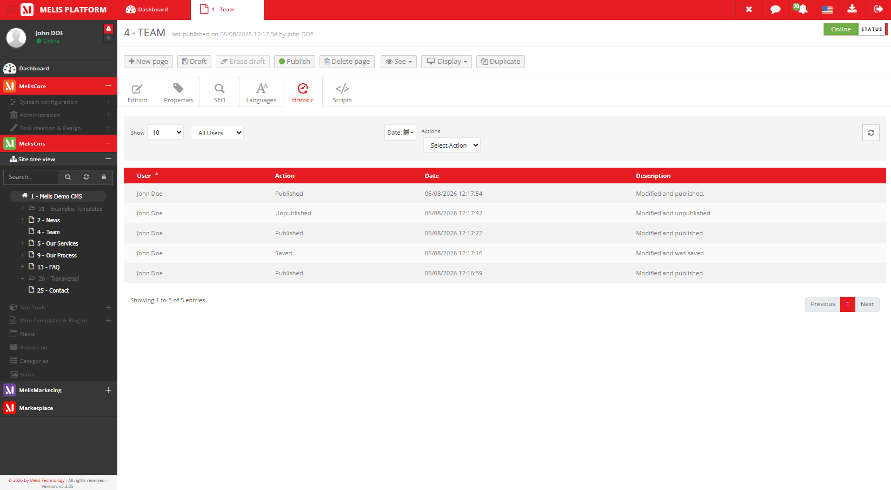
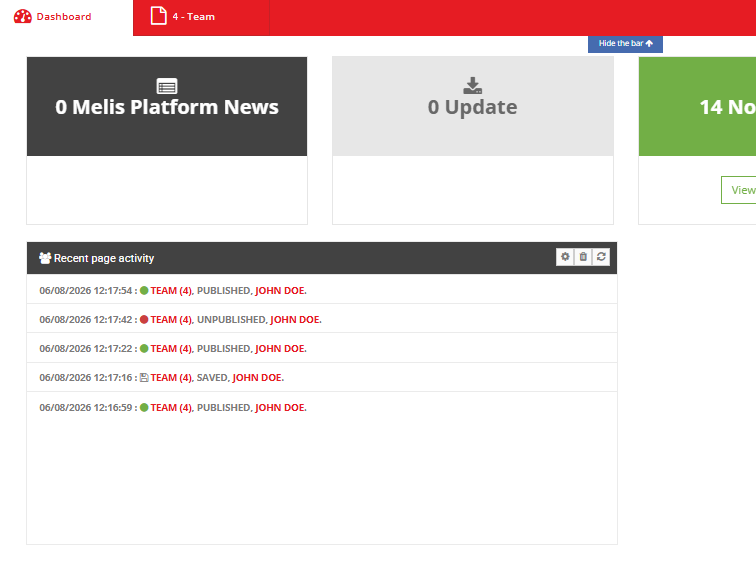

# MelisCmsPageHistoric — Functional & Technical Documentation (for AI)

> **What this is.** MelisCmsPageHistoric is the **audit log for page editing**: it automatically
> records who did what to a page and when (create, edit, publish, delete…), and shows that
> history in a **"Historic" tab inside the page editor** and a **"Recent User Activity"**
> dashboard widget. Logging is automatic — there's nothing to switch on per action.
>
> **Two parts:** **[Part A — Functional Guide](#part-a--functional-guide)** (users) ·
> **[Part B — Technical Reference](#part-b--technical-reference)** (developers/AI, with examples).
> Consumed by the **MelisAI** MCP; the **[Screenshot index](#screenshot-index)** maps filenames.
> Reviewed 2026-06-08.

---
---

# PART A — Functional Guide

## A1. What MelisCmsPageHistoric lets you do

- **See the full history of a page** — every save, publish, unpublish and delete, with who did
  it and when.
- **See recent activity across all pages** at a glance on the dashboard.

There's nothing to configure: once the module is installed, it logs page actions automatically.

## A2. The Historic tab (inside the page editor)

**Where:** open any page in the **page editor** → the **Historic** tab (history icon).

It shows a read-only table of **this page's** actions: **User**, **Action**, **Date**,
**Description**. Filter by **limit**, **user**, **date** and **action type**, or **refresh**.


*The page editor's Historic tab — the audit trail of the current page, with filters.*

> The Historic tab only shows the **current page**'s history. For activity across all pages, use
> the dashboard widget (below).

## A3. The Recent User Activity dashboard widget

On the back-office **Dashboard**, the **Recent User Activity** widget lists recent page actions
across all users.


*Recent page activity across users, on the dashboard.*

## A4. Common questions

- **"Who changed this page?"** → open the page → **Historic** tab.
- **"What's been happening lately?"** → the **Recent User Activity** dashboard widget.
- **"Can I undo from here?"** → no, it's a read-only log (for accountability), not a restore tool.

---
---

# PART B — Technical Reference

## B1. Metadata & dependencies

| Item | Value |
|---|---|
| Package | `melisplatform/melis-cms-page-historic` · category `cms` · namespace `MelisCmsPageHistoric\` · dbdeploy |
| Requires | `melis-core`, `melis-engine`, `melis-front`, `melis-cms` (`^5.2`) |

## B2. Data model

| Table | Role | PK |
|---|---|---|
| `melis_hist_page_historic` | One recorded page action: `hist_page_id`, `hist_action`, `hist_date`, `hist_user_id`, `hist_description` | `hist_id` |

Gateway: `MelisPageHistoricTable`. No dedicated service class — reads/writes go through the
gateway plus the controller's save/delete actions.

## B3. How history is recorded (the listener pattern — reusable example)

Two listeners (wired in `src/Module.php`, back-office only) hook the **MelisCms page lifecycle
events** and write a row each time. This is the canonical example of reacting to page events —
any module can do the same:

```php
// In Module.php onBootstrap:
$sharedEvents = $eventManager->getSharedManager();
$sharedEvents->attach('MelisCms', 'meliscms_page_publish_end', function ($e) {
    $params = $e->getParams();          // page id, page data…
    // record: who/what/when -> melis_hist_page_historic
}, 50);
```

- `MelisPageHistoricPageEventListener` — records save/publish/… actions.
- `MelisPageHistoricDeletePageListener` — records (and cleans up on) `meliscms_page_delete_end`.

The full set of hookable page events is documented in the
[MelisCms](../../../melis-cms/etc/MelisAI/doc/MelisCms.md) doc (§B7).

## B4. The Historic tab & dashboard plugin

- **Historic tab**: injected via `config/app.interface.php` (key `melispagehistoric_historic`,
  icon `history`) into the CMS page-editor tabs. Controller `PageHistoricController`
  (`getPageHistoricDataAction` feeds the DataTable, scoped by `hist_page_id`; filters:
  limit/user/date/action; user list via `getBackOfficeUsersAction`). Table config in
  `config/app.tools.php` (`tool_meliscmspagehistoric`). Read-only.
- **Dashboard plugin**: `DashboardPlugins/MelisCmsPageHistoricRecentUserActivityPlugin`
  (`recentActivityPages`), config in `config/dashboard-plugins/…`, section *MelisCms*.

## B5. Quick code map

```
melis-cms-page-historic/
├── config/   module.config.php · app.interface.php (Historic tab) · app.tools.php · app.forms.php
│            · dashboard-plugins/ (Recent User Activity)
├── src/   Controller/ (PageHistoricController, DashboardPlugins/)
│        · Listener/ (PageEvent, DeletePage) · Model/Tables/MelisPageHistoricTable
├── view/ · public/ · language/ · install/ (SQL)
└── etc/   MarketPlace + MelisAI/doc (this doc)
```

---

## Screenshot index

| Image file | Content |
|---|---|
| `meliscmspagehistoric-page-tab-historic.png` | Historic tab in the page editor (user/action/date/description + filters) |
| `meliscmspagehistoric-dashboard-plugin-recentactivity.png` | Recent User Activity dashboard widget |

---

*Document for AI consumption (MelisAI MCP) — `melisplatform/melis-cms-page-historic`. Part A =
functional; Part B = technical with examples. Last reviewed 2026-06-08.*
